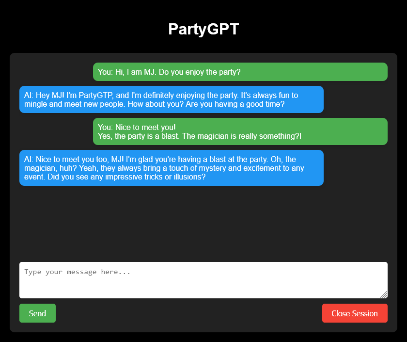

# partyGPT

## Introduction
Ever wondered how it is to not only have human guests on your party?
Human party guests, especially those new to the field of natural language processing, are greatly fascinated and entertained by the verbalization skills and the eloquence of well-trained multi-purpose large language models.
Invite an artificial-intelligence-based person to your party!
Let them have conversations using an interface creatively crafted by GPT-3.5-Turbo itself.
All you need is a device running Python, a web browser and an account at [OpenAI](https://platform.openai.com).
(Make sure to set appropriate soft and hard limits on your payment type. Using GPT-3.5-Turbo for this task is very cheap though.)

<p align="center">
  
</p>


## Installation
* Install using poetry:
    ```sh
    python -m poetry install
    ```
* Provide an `.env` file with the following environment variables:
    * OPENAI_API_KEY - [your OpenAI-issued API key](https://platform.openai.com/account/api-keys)
    * OPENAI_ORG - [your Organization ID](https://platform.openai.com/account/org-settings)

## Usage
* Modify the contents of [`settings.yml`](settings.yml) to personalize the application.
* Make it transparent for your guests that their data is sent to an OpenAI server and that conversation records are created (conversation records can be deactivated via [`settings.yml`](settings.yml)).
* Run the application:
    * Option 1 (OS-agnostic):
        ```sh
        python -m poetry run python app.py
        ```
    * Option 2 (Windows): Run [`app_run.bat`](app_run.bat)

## Development
* Proceed as instructed in section [Installation](#installation).
* ... go right at it.

## To Do
* Website/Frontend
    * check if input sanitation suffices
    * create concept for allowing guests to load the frontend from their personal devices from within a network (-> distinguish various sessions, load balancing etc.)
* Python Backend
    * Administration
        * Max token limit for conversation
        * handle "spam" (user divides answers in multiple consecutive messages) --> lock input field until AI response received?
        * deactivate conversation recording per default
    * Specific cases
        * model sometimes halucinates and talks to itself, if very short/non-sensical user message provided (e.g. 'a')
    * Personas
        * Instructions
            * avoid wall of text (keep it short and entertaining), model still too wordy sometimes
            * end conversation after x contacts, model still easily conviced to stick to a conversation
        * character
            * sample from sentiments (being drunk, in love, etc.)
